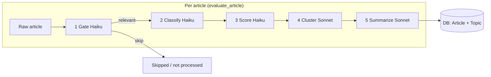
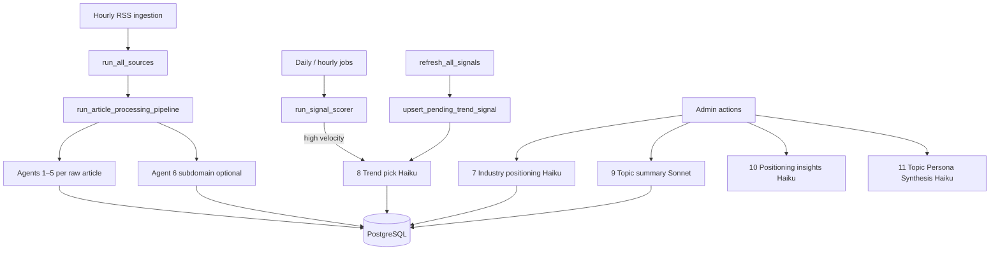
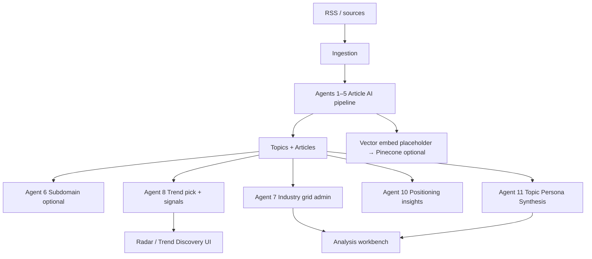

# AI agents and flows (Pulse of Technology)

This document describes **every distinct LLM “agent”** (separate system prompt + purpose) in the backend, how they connect, and which **Claude** models they use.

## Models

| Model constant | Typical use |
|----------------|-------------|
| **Claude Haiku** (`claude-haiku-4-5-20251001`) | Fast, cheaper tasks: gates, classification, scoring, trend picks, industry grid, positioning insights |
| **Claude Sonnet** (`claude-sonnet-4-6`) | Heavier reasoning: topic clustering label, article summarization with personas, topic-level executive summary |

**Not LLM:** `vector_service.embed_text()` uses a **deterministic pseudo-embedding** (hash-based), not Anthropic. Pinecone is optional; comments in code mention swapping to Voyage or similar later.

## How many agents?

There are **12** distinct Anthropic-backed agents (different system prompts / roles). **11** are wired into production or admin flows. **1** is implemented but **not called** anywhere in the app today (`evaluate_signal` — adoption-state upgrade prompt).

| # | Agent (logical name) | Model | Primary function | Triggered by |
|---|----------------------|-------|------------------|--------------|
| 1 | **Gate** | Haiku | Relevance filter (exec-tech vs noise) | `process_raw_articles` → `evaluate_article` |
| 2 | **Classify** | Haiku | Domain, subdomain theme, tags | same chain |
| 3 | **Score** | Haiku | Per-article urgency 1–10 | same chain |
| 4 | **Cluster** | Sonnet | Pick existing topic name or suggest new | same chain |
| 5 | **Summarize** | Sonnet | `what_is_it`, `why_it_matters`, `persona_impacts` | same chain |
| 6 | **Subdomain label** | Haiku | Short editorial subdomain string for a topic | `fill_missing_topic_subdomains`, admin suggest-subdomain |
| 7 | **Industry positioning** | Haiku | Full 20-industry grid (impact, risk, phase, rationales) | Admin `suggest-industry-positions`, AI Suggest on Analysis |
| 8 | **Trend pick** | Haiku | `watch` / `radar` / `remove` for Trend Discovery | `signal_service` (`upsert_pending_trend_signal`, `run_signal_scorer` when thresholds pass) |
| 9 | **Topic executive summary** | Sonnet | Topic-level summary + why it matters | Admin generate-summary endpoint |
| 10 | **Positioning insights** | Haiku | Per-topic trend label + note (velocity windows) | `trend_service.build_positioning_insights` (API for admin/insights) |
| 11 | **Topic Persona Synthesis** | Haiku | Per-role business impact lines for the topic (`persona_by_role`) | Admin `/suggest-persona-by-role` endpoint (`POST /api/admin/topics/{topic_id}/suggest-persona-by-role`) |
| 12 | **Signal / adoption upgrade** *(unused)* | Haiku | Whether to change topic adoption state from recent press | `evaluate_signal` in `ai_service.py` — **no router or job calls it** |

Implementation lives mainly in `backend/services/ai_service.py` (`_call`, `_node_*`, `suggest_*`, `evaluate_*`, `generate_topic_summary`, `suggest_topic_persona_by_role`) and `backend/services/trend_service.py` (`_call_ai_insights`).

---

## Diagram: article ingestion pipeline (5 agents in sequence)

Raw RSS articles enter **`process_raw_articles`**; each article runs **`evaluate_article`** unless the gate fails early.

After articles are processed, **subdomain backfill** may call **agent 6** for topics missing a subdomain (batched, capped). **Embeddings** run separately (non-LLM).

---

## Diagram: scheduled / manual jobs (signals, trends, admin)

---

## Diagram: end-to-end (simplified)

---

## Related files

- `backend/services/ai_service.py` — central prompts and `_call` wrapper
- `backend/services/signal_service.py` — velocity/acceleration + `evaluate_trend_pick`
- `backend/services/trend_service.py` — `build_positioning_insights` + Haiku insights
- `backend/services/ingestion.py` — orchestrates processing + embeddings
- `backend/services/vector_service.py` — embeddings (not Anthropic today)

If you wire **agent 12** (`evaluate_signal`) into a job or admin action, update this doc and the table above.
